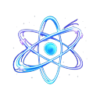
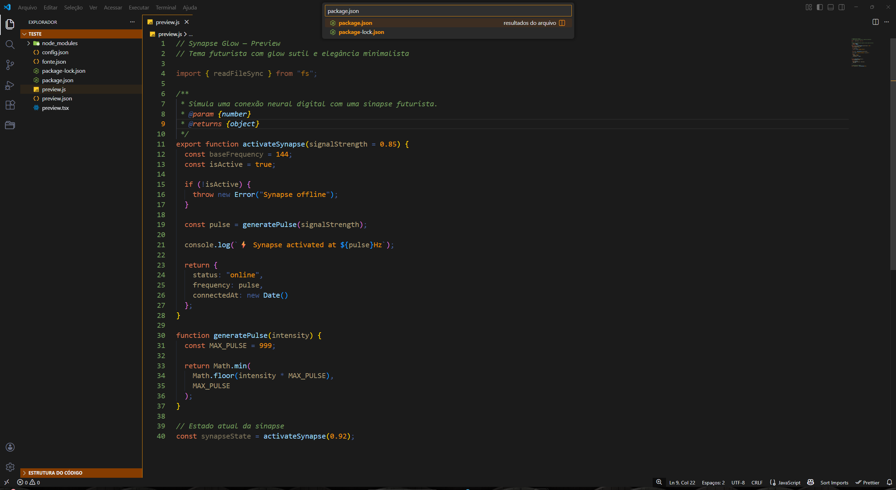
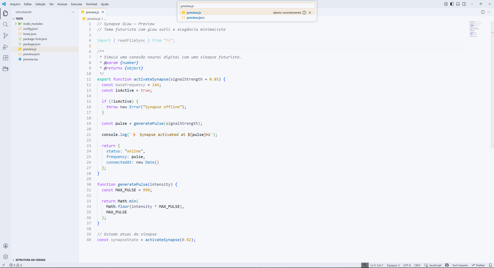

# ✨ Synapse Glow

**Tema futurista para VS Code** — glow sutil, elegância minimalista e conforto visual para longas sessões de programação.

 

<!-- Badges (simples e compatíveis) -->

---

## 🌌 Características

- 🎨 Design futurista e minimalista  
- 💡 Glow sutil, sem cansar os olhos  
- 🌙 Modo Dark profundo e confortável  
- ☀️ Modo Light limpo e elegante  
- 🧠 Excelente legibilidade para longas sessões  
- ⚡ Destaques claros para funções, variáveis e keywords  

---

## 🖼️ Preview

### 🌙 Dark

### ☀️ Light
